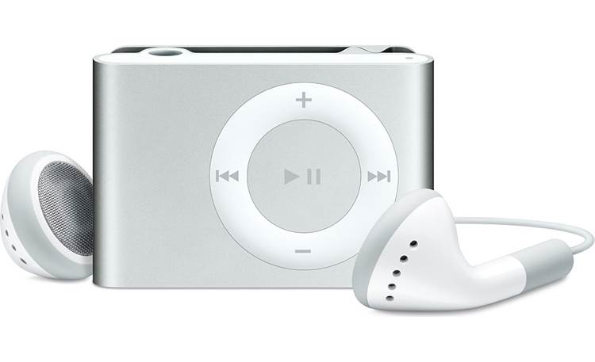
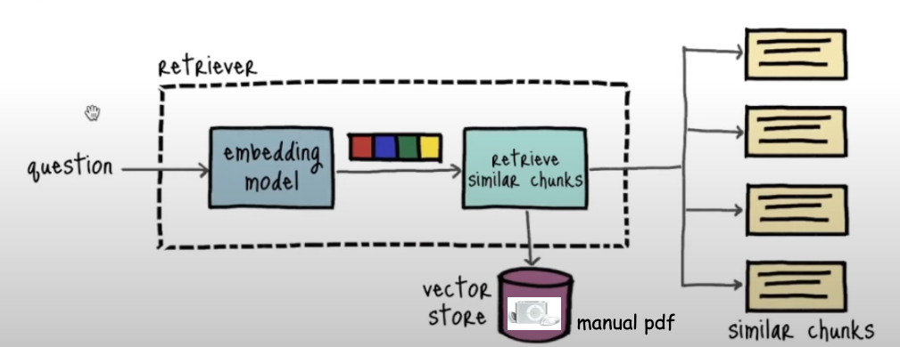
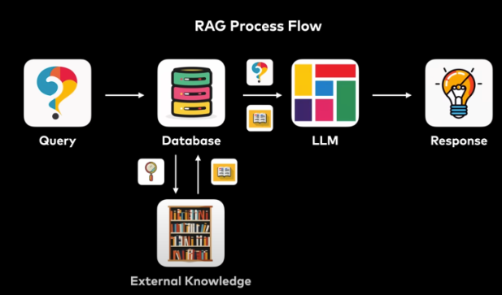
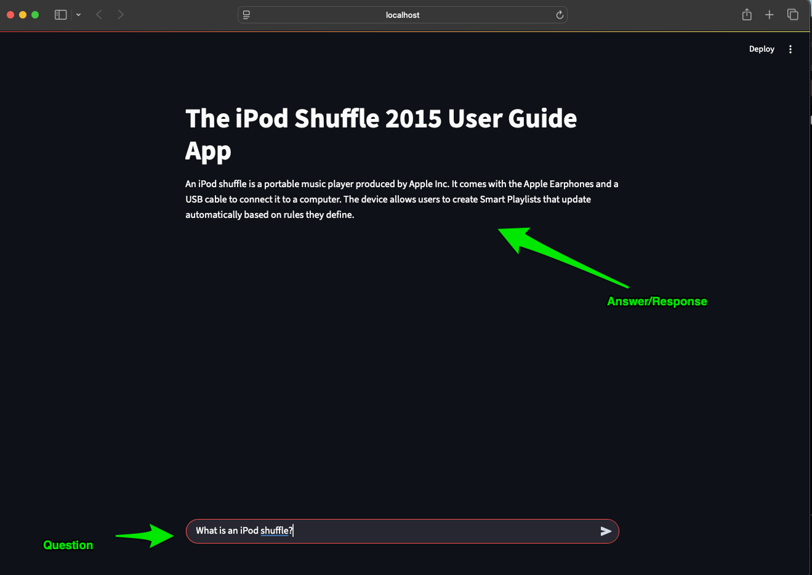

# Retrieval Augmented Generation (RAG) Q&A Mechanism to Access User Guide Information - Loving My 2010 iPod Shuffle

<p>
  
</p>

[img source: crutchfield](https://www.crutchfield.com/p_472SHFL1S/Apple-iPod-shuffle-1GB-Silver.html)

## Project Description

Traditional Large Language Models (LLM) are trained on large datasets and can generate human-like text, but their knowledge is limited to the data they were trained upon. In addition to this knowledge limitation is the fact that these LLMs often produce inaccurate or outdated information. A way to improve these limitations is to use Retrieval Augmented Generation (RAG) to connect the LLM with external data sources (e.g., databases or even pdf files like this project will show). It is well understood that RAG improves the accuracy of LLM's because it reduces the risk of LLMs "hallucinating" or generating incorrect information by grounding the LLM's responses in actual factual data from external data sources. With RAG, learning models get access to up-to-date information, eliminating the limitation of LLMs being restricted only to training data. LLMs with RAG are now able to understand a user's query better and able to generate more contextually appropriate responses. One additional benefit, is that RAGs are a more cost efficient way to customize LLMs compared with retraining or fine-tuning the LLM which would mean having to calculate new weights and biases based on the new data.

## Problem

I loved my little `Silver iPod Shuffle`. Terrifically Small. Clips On! Weighs about the same as a USD quarter. It is the best! I recently found the little beauty tucked away in a desk drawer and after a little usb power cable searching, I was able to resurrect it from its deep coma.

I had some initial weird warning lights on startup and since the hard copy manuals I had for it are long since gone, I quickly hopped onto the Internet to find the manual to diagnose the issues. It got me thinking, this is a job for Artificial Intelligence. Specifically, I would love to be able to ask a Chatbot how to diagnose or fix my problem.

So, in short, I decided to design a RAG system to become my "iPod Shuffle AI Assistant"

### My Solution

This project builds a RAG model using LangChain and an initial Llama 3.2 LLM. I inject new knowledge, the iPod user manual, as a vector database, chunking the manual pdf file into various sections. I created a simple question and response application, where the model in the middle is the RAG model with all of its embedding, prompt engineering, and retrieval goodness. The application has the following form:

<p>
  
</p>

[img source](https://www.youtube.com/watch?v=Y08Nn23o_mY)

The RAG process flow looks similar to the following:

<p>
  
</p>

[img source](https://www.youtube.com/watch?v=Y08Nn23o_mY)

Lastly, I turn this RAG model into a shareable web application using the [Streamlit](https://streamlit.io/) Python web framework whereby users can pose questions related to the iPod Shuffle or not and receive possible answers to their questions.

---

## Objective

The project contains the key elements:

- `ChatOllama` instantiates chatbot like feature,
- `Deep Learning` for neural network building,
- `FAISS` open source vector embedding database making it easy to build LLM apps
- `Faiss-cpu` CPU only version of Facebook AI Similarity Search used for similarity search and clustering of dense vectors,
- `Git` (version control),
- `Jupyter` python coded notebooks,
- `LangChain`, simplify the creation of applications using chaining process with LLMs,
- `Natural Language Processing (NLP)` to understand, interpret, and manipulate text,
- `Llama 3.2` ollama simple model providing initial LLM,
- `Prompt Engineering` to provide instructions for the LLM on how to retrieve information,
- `Pypdf` to manipulate pdf files,
- `Python` the standard modules,
- `Retrieval Augmented Generation (RAG)` connect the LLM with external data sources,
- `Streamlit` Python web framework to deploy the app on a local web server,
- `Transfer Learning`, to adapt weights and biases to learn on new data for a pre-existing highly built model, and
- `uv` package management including use of `ruff` for linting and formatting.

---

## Tech Stack


---

## Getting Started

Here are some instructions to help you set up this project locally.

---

## Installation Steps

The Python version used for this project is `Python 3.12`.

### Download Ollama

Obtain the Ollama Application to run the Ollama Server [here](https://github.com/ollama/ollama?tab=readme-ov-file).

**Note** After building the project or anytime later you can also uninstall Ollama, if you are like me, and want to declutter your computing device.
(see instructions for MacOS [here](https://www.youtube.com/watch?v=GRsy_Kaeq84)).

Here is an [Ollama Cheatsheet](https://secretdatascientist.com/ollama-cheatsheet/) as well.

### Clone the Repo

1. Clone the repo (or download it as a zip file):

   ```bash
   git clone https://github.com/beenlanced/ai_rag_user_guide.git
   ```

2. Create a virtual environment named `.venv` using `uv` Python version 3.12:

   ```bash
   uv venv --python=3.12
   ```

   This can also be accomplished just by running `app.py` from with the `src/` directory.

   ```bash
   uv run streamlit run app.py
   ```

3. Activate the virtual environment: `.venv`

   On macOs and Linux:

   ```bash
   source .venv/bin/activate #mac
   ```

   On Windows:

   ```bash
    # In cmd.exe
    venv\Scripts\activate.bat
   ```

4. Install packages using `pyproject.toml` or (see special notes section)

   ```bash
   uv pip install -r pyproject.toml
   ```

### Install the Jupyter Notebook(s) to run the EDA notebook

1. **Run the EDA POC**

   - Run the Jupyter Notebook(s) in the Jupyter UI or in VS Code.

### Running the Streamlit app

0. **Make sure the Ollama Server is running**

1. **Run app.py script**

   From a terminal, navigate to the location of the `app.py` file.
   in the terminal type:

   ```bash
   uv run streamlit run app.py
   ```

   or if you are not using `uv`

   ```bash
   streamlit run app.py
   ```

   It may take some time for the app to render a browser depending upon the type of processor you are running, so you may have to
   have a little patience when posting a question and especially when awaiting a response. Good things come to those who wait.

2. **View App from a browser**

   It may take a moment, but streamlit should launch. Afterwards, you can now view the Streamlit iPod app in a browser.

   ```
   Local URL: http://localhost:8501
   ```

3. **Example Rendering**

   The broswer should render a result similar to the following where you will be able to ask questions and receive responses related to the iPod user manual (see figure below).

   <p>
      
   </p>

4. **Close the App**

   To close out of the application terminate the browser and type `ctrl-c` in your terminal to stop the streamlit process.

---

### Final Words

Thanks for visiting.

Give the project a star (⭐) if you liked it or if it was helpful to you!

You've `beenlanced`! 😉

---

## Acknowledgements

I would like to extend my gratitude to all the individuals and organizations who helped in the development and success of this project. Your support, whether through contributions, inspiration, or encouragement, have been invaluable. Thank you.

Specifically, I would like to acknowledge:

- The folks at Apple, Inc. for their [iPod Shuffle (4th generation) user guide](https://support.apple.com/en-us/docs/ipod/133017) and the wonderful device. I wish they would still manufacture them.

- The folks at Langchain for their [FAISS Documentation](https://python.langchain.com/docs/integrations/vectorstores/faiss/).

- [Hema Kalyan Murapaka](https://www.linkedin.com/in/hemakalyan) and [Benito Martin](https://martindatasol.com/blog) for sharing their README.md templates upon which I have derived my README.md.

- The folks at Astral for their UV [documentation](https://docs.astral.sh/uv/)

---

## License

This project is licensed under the MIT License - see the [LICENSE](./LICENSE) file for details
